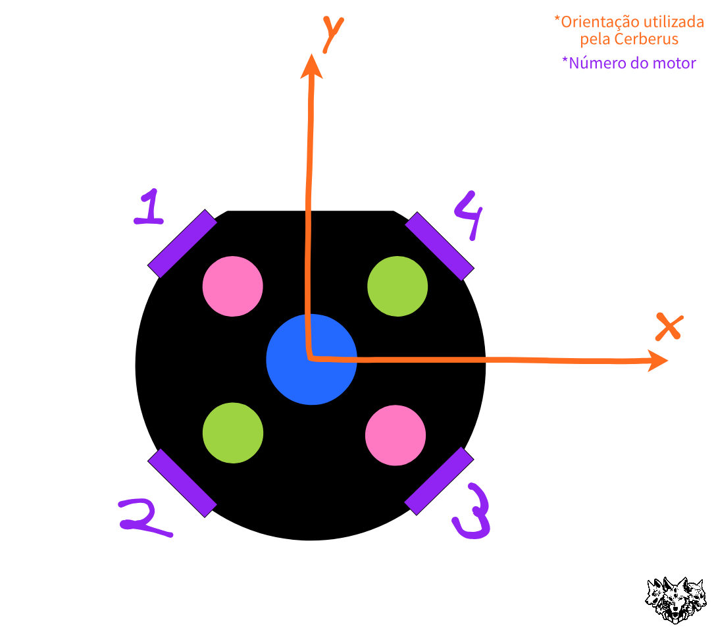

# Core

## Instruções para instalação

### Primeiro(instalação):

Não utilize os softwares da SSL, como o [ssl-vision](https://github.com/RoboCup-SSL/ssl-vision) e o [game-controller](https://github.com/RoboCup-SSL/ssl-game-controller), instalados localmente, porém instale as dependências deles em seu dispostivo.

Utilize Docker para rodar os softwares da competição(comandos em [Rodar os softwares da SSL](https://github.com/CerberusRobotica/Core?tab=readme-ov-file#rodar-os-softwares-da-ssl) para rodar manualmente);

Tutorial de instalação da bilioteca Docker e de todos os softwares da SSL utilizados nesse framework em "Programação/Frameworks da SSL/Tutorial para instalar os softwares da SSL" no drive da equipe Cerberus.
	
	
Instalar dependências:

	./install_packages.sh
		

### Segundo(construir o framework):

Construa os três programas em C++ (com o terminal aberto na pasta principal):

	./build_core.sh

### Finalmente(rodar):

Rodar os executáveis (com o terminal aberto na pasta principal)

Para rodar apenas o Hades, Hermes, Caronte e Íris:

	./run.sh
 ou, para rodar com o GrSim e o Game-Controller:
 
 	./run_with_simulator.sh

	
## Rodar os softwares da SSL

### [Grsim](https://github.com/RoboCup-SSL/grSim):

Com VNC(Remmina): 
	
	sudo docker pull robocupssl/grsim:latest && sudo docker run --net=host -eVNC_PASSWORD=vnc -eVNC_GEOMETRY=1920x1080 robocupssl/grsim vnc

Inicie o Remmina. Conecte em localhost:5900. Insira a senha "vnc".

Ou

Headless: 
	
	sudo docker pull robocupssl/grsim:latest && sudo docker run robocupssl/grsim

### Game-Controller:

	sudo docker pull robocupssl/ssl-game-controller && sudo docker run -p 8081:8081 robocupssl/ssl-game-controller -address :8081

### AutoReferee da [Tigers](https://github.com/TIGERs-Mannheim/AutoReferee):

	./run.sh

### LCM spy:

	lcm-spy

## Orientação utilizada pela equipe:

