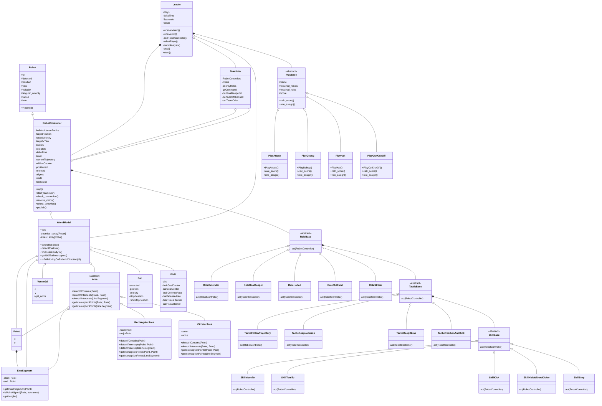

# HADES

[//]: # (Explicação a respeito do que será desenvolvido nesta parte do projeto)

```mermaid
classDiagram
    direction BT
    
%%    -------STRATEGY--------  
    
    class Leader {
        -Plays
        -deltaTime
        -TeamInfo
        -World
        -receiveVision()
        -receiveGC()
        -addRobotController()
        -selectPlays()
        -worldAnalysis()
        -stop()
        +start()
    }
    
    class Robot {
        #id
        #detected
        #position
        #yaw
        #velocity
        #angular_velocity
        #radius
        #role
        +Robot(id)
    }
    
    class RobotController {
        -ballAvoidanceRadius
        -targetPosition
        -targetVelocity
        -targetVYaw
        -kickerx
        -roleState
        -deltaTime
        -timer
        -currentTrajectory
        -offLineCounter
        -positioned
        -oriented
        -aligned
        -world
        -hasKicker
        -stop()
        +start(TeamInfo*)
        +check_connection()
        +receive_vision()
        +select_behavior()
        +publish()
    }
    RobotController --|> Robot
    RobotController --* Leader
    RobotController --o TeamInfo
    
    class TeamInfo {
        -RobotControllers
        -Roles
        -enemyRoles
        -gcCommand
        -ourGoalKeeperId
        -ourSideOfTheField
        -ourTeamColor
    }
    TeamInfo --o RobotController
    TeamInfo --o Leader
    
%%    -------GEOMETRY--------  
    
    class Point {
        -x
        -y
    }
    Point --o WorldModel
    Point --o Area
    
    class LineSegment {
        -start : Point
        -end : Point
        +getPointProjection(Point)
        +isPointAligned(Point, tolerance)
        +getLenght()
    }
    LineSegment --* Point
    LineSegment --o WorldModel
    LineSegment --o Area
    
    class Vector2d {
        -x
        -y
        +get_norm
    }
    Vector2d --o WorldModel
    
    class Area {
        <<abstract>>
        +detectIfContains(Point)
        +detectIfIntercepts(Point, Point)
        +detectIfIntercepts(LineSegment)
        +getInterceptionPoints(Point, Point)
        +getInterceptionPoints(LineSegment)
    }
    Area --o WorldModel
    
    class RectangularArea {
        -minorPoint
        -majorPoint
        +detectIfContains(Point)
        +detectIfIntercepts(Point, Point)
        +detectIfIntercepts(LineSegment)
        +getInterceptionPoints(Point, Point)
        +getInterceptionPoints(LineSegment)
    }
    RectangularArea --|> Area
    
    class CircularArea {
        -center
        -radius
        +detectIfContains(Point)
        +detectIfIntercepts(Point, Point)
        +getInterceptionPoints(Point, Point)
        +getInterceptionPoints(LineSegment)
    }
    CircularArea --|> Area
    
    class Ball {
        -detected
        -position
        -velocity
        -stopPosition
        +findStopPosition
    }
    Ball --o WorldModel
    
    class WorldModel {
        +field
        -enemies : array[Robot]
        -allies : array[Robot]
        +detectBallSide()
        +detectIfBallIsIn()
        +findNearestAllyTo()
        +getIdOfBallInterceptor()
        +IsBallMovingOnRobotIdDirection(Id)
    }
    WorldModel --o RobotController
    WorldModel --o Leader
    
    class Field {
        -size
        -theirGoalCenter
        -ourGoalCenter
        -theirDefenseArea
        -ourDefenseArea
        -theirFisicalBarrier
        -ourFisicalBarrier
    }
    Field --o WorldModel
    
    
%%    -------PLAYS--------
    
    class PlayBase {
        <<abstract>>
        #name
        #required_robots
        #required_roles
        #score
        +calc_score()
        +role_assign()
        
    }
    PlayBase --* Leader
    
    class PlayAttack {
        +PlayAttack()
        +calc_score()
        +role_assign()
    }
    PlayAttack --|> PlayBase
    
    class PlayDebug {
        +PlayDebug()
        +calc_score()
        +role_assign()
    }
    
    PlayDebug --|> PlayBase
    
    class PlayHalt {
        +PlayHalt()
        +calc_score()
        +role_assign()
    }
    PlayHalt --|> PlayBase
    
    class PlayOurKickOff {
        +PlayOurKickOff()
        +calc_score()
        +role_assign()
    }
    PlayOurKickOff --|> PlayBase
    
    
%%    -------ROLES--------
    class RoleBase {
        <<abstract>>
        act(RobotController)
    }
    RoleBase --* RobotController
    
    class RoleDefender {
        act(RobotController)
    }
    RoleDefender --|> RoleBase
    
    class RoleGoalKeeper {
        act(RobotController)
    }
    RoleGoalKeeper --|> RoleBase
    
    class RoleHalted {
        act(RobotController)
    }
    RoleHalted --|> RoleBase
    
    class RoleMidField {
        act(RobotController)
    }
    RoleMidField --|> RoleBase
    
    class RoleStriker {
        act(RobotController)
    }
    RoleStriker --|> RoleBase
    
%%    -------TACTICS--------
    class TacticBase {
        <<abstract>>
        act(RobotController)
    }
    TacticBase --* RoleBase
    
    class TacticFollowTrajectory {
        act(RobotController)
    }
    TacticFollowTrajectory --|> TacticBase
    
    class TacticKeepLocation {
        act(RobotController)
    }
    TacticKeepLocation --|> TacticBase
    
    class TacticKeepXLine {
        act(RobotController)
    }
    TacticKeepXLine --|> TacticBase
    
    class TacticPositionAndKick {
        act(RobotController)
    }
    TacticPositionAndKick --|> TacticBase
    
%%    -------SKILLS--------
    
    class SkillBase {
        <<abstract>>
        act(RobotController)
    }
    SkillBase --* TacticBase
    
    class SkillMoveTo {
        act(RobotController)
    }
    SkillMoveTo --|> SkillBase
    
    class SkillTurnTo {
        act(RobotController)
    }
    SkillTurnTo --|> SkillBase
    
    class SkillKick {
        act(RobotController)
    }
    SkillKick --|> SkillBase
    
    class SkillKickWithouKicker {
        act(RobotController)
    }
    SkillKickWithouKicker --|> SkillBase
    
    class SkillStop {
        act(RobotController)
    }
    SkillStop --|> SkillBase
    
    
    
    
```